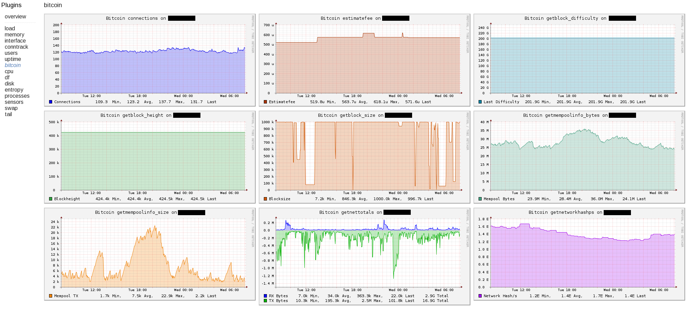

collectd-bitcoin.py
======
Small python snippet to query bitcoind via rpc and generate rrd via collectd

This is based on a python script from C-Otto found at:

https://gist.github.com/C-Otto/a9e4864dff1a2b167761
 
Biggest change is that it uses rpc connection instead of calling

bitcoin-cli binary and added some more stuff to log.

Together with something like [CGP](https://github.com/pommi/CGP) it can generate nice graphs:

(Note if you use CGP, there is a custom plugin to control colors/naming scheme in [the CGP/ subfolder](CGP/).)

Usage
======

Needs a running bitcoin-{core,classic,unlimited} daemon with rpc user/password set.

This is needed to connect via rpc: https://github.com/jgarzik/python-bitcoinrpc

Replace ```rpcuser``` and ```rpcpassword``` with your bitcoind rpc username/password in the script.

Enable collectd exec plugin:
```
LoadPlugin exec
```

and put something like this into collectd.conf
```
<Plugin exec>
        Exec "nobody:nogroup" "/path/to/script/collectd-bitcoin.py"
</Plugin>
```
